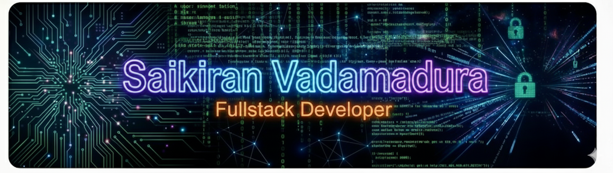

<!-- ===== Custom Hacker Banner ===== -->

  

<h3 align="center">
Software Engineer | Full-Stack Developer | AI/ML Enthusiast
</h3>

Building intelligent systems in the dark ⚡

---

## 👨‍💻 About Me

- 💻 Software Engineer focused on **Full-Stack, Backend & AI/ML**
- 🤖 Passionate about **Machine Learning & Deep Learning**
- 🧠 Strong foundation in **Data Structures & Algorithms**
- 🚀 Love building scalable, real-world systems

---

## 🧑‍💻 Programming Languages & Tools

  

---

## 🌐 Connect With Me

---

## 🚀 Featured Work

- 🔹 PPE Detection System  
- 🔹 Accident Identification & Alert System (CNN)  
- 🔹 AI-Driven Recommendation Systems  
- 🔹 Full-Stack SaaS Applications  

---

⚡ Welcome to my GitHub ⚡  
Code. Learn. Build. Repeat.

